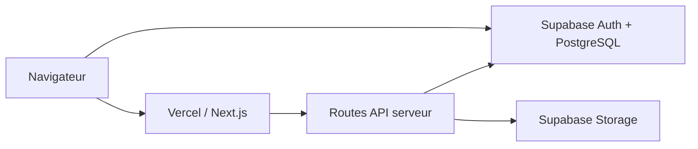

<p align="center">
  
</p>

# Résultats CESI

Plateforme web de suivi académique pour les sessions CESI : notes, UE, compensations, rattrapages, dettes et préparation des jurys.

L'application est conçue pour être déployée avec **Next.js + Vercel** et utilise **Supabase** pour l'authentification, la base PostgreSQL et le stockage des fichiers Excel.

---

## Sommaire

1. [Fonctionnalités](#fonctionnalités)
2. [Guide d'utilisation](#guide-dutilisation)
   - [Créer un compte et se connecter](#créer-un-compte-et-se-connecter)
   - [Créer et suivre une session](#créer-et-suivre-une-session)
   - [Importer les notes](#importer-les-notes)
   - [Importer un référentiel](#importer-un-référentiel)
   - [Notes et résultats UE](#notes-et-résultats-ue)
   - [Rattrapages et dettes](#rattrapages-et-dettes)
   - [Jury](#jury)
3. [Règles de calcul](#règles-de-calcul)
4. [Architecture technique](#architecture-technique)
5. [Installation Supabase](#installation-supabase)
6. [Déploiement GitHub + Vercel](#déploiement-github--vercel)
7. [Variables d'environnement](#variables-denvironnement)

---

## Fonctionnalités

- **Sessions** identifiées par un nom et un code analytique, par exemple `FISA S3E 24-27 Toulouse` / `tl42t201`.
- Deux structures de cycle : **CPI** (A1, A2 / S1 à S4) et **cycle ingénieur** (A3, A4, A5 / S5 à S10).
- Tous les comptes authentifiés peuvent voir et modifier les données. Chaque utilisateur peut **suivre** ou **ne plus suivre** une session pour personnaliser son tableau de bord.
- Import général des **notes Excel**, y compris lorsqu'un même fichier contient plusieurs sessions.
- Import du **cahier des charges / référentiel** pour une session choisie.
- Conservation des fichiers Excel originaux dans un bucket privé **Supabase Storage** et stockage des données structurées dans PostgreSQL.
- Modification manuelle en ligne des notes et des informations étudiant (nom, option, infos complémentaires), puis possibilité de réimporter le fichier.
- Affichage prioritaire de la **lettre finale** (`C/B` affiche `B`) et détail de la note numérique au survol.
- Gestion des absences **AJ** et **ANJ**, avec le même effet académique pour le moment.
- Calcul des résultats d'UE et des compensations.
- Onglet **Rattrapages** avec synthèse, proposition de créneaux parallèles, matrice de compatibilité, mails et export Excel.
- Création automatique de **dettes** lorsqu'une UE reste non validée après un rattrapage visible par un slash ; validation manuelle de la dette et conservation des ex-dettes.
- Onglet **Jury** par année avec avis automatique, surcharge manuelle, cas complexes, informations complémentaires et préconisations numérotées.
- Tableau de bord priorisant les cas particuliers et listant les notes non saisies.

---

## Guide d'utilisation

### Créer un compte et se connecter

La connexion utilise un **pseudo** et un mot de passe. Supabase exige techniquement une adresse email : l'application transforme donc le pseudo en adresse interne invisible de la forme `pseudo@resultats-cesi.local`.

Pour créer un compte, l'utilisateur renseigne :

- un pseudo ;
- son nom affiché ;
- un mot de passe d'au moins 8 caractères ;
- le mot de validation partagé : **EUROVISION**.

Le mot `EUROVISION` n'est pas enregistré dans le navigateur : il est vérifié côté serveur grâce à la variable `ACCOUNT_CREATION_SECRET`.

### Créer et suivre une session

Dans **Sessions**, créez une session avec :

- son nom exact ;
- son code analytique ;
- le type de cycle ;
- le campus.

La création génère automatiquement les années et semestres correspondants. Le créateur suit automatiquement la nouvelle session. Le bouton cloche permet ensuite à chaque utilisateur de s'abonner ou de se désabonner.

> Important : le nom de session présent dans le fichier Excel de notes doit correspondre exactement au nom créé dans l'application.

### Importer les notes

Dans **Imports > Notes — import général**, choisissez le fichier `.xlsx`.

Le format attendu reprend le fichier fourni au projet :

- `Session`
- `Personne`
- `Option choisie` (facultatif)
- triplets de colonnes `Eval - ...`, `Seme - ...`, `Notes - ...`

Un seul fichier peut contenir plusieurs sessions. Toutes les sessions mentionnées doivent déjà avoir été créées dans l'application.

Une réimportation met à jour les mêmes étudiants / évaluations / notes. Les fichiers sources restent archivés dans Supabase Storage.

### Importer un référentiel

Dans **Imports > Cahier des charges / référentiel** :

1. choisissez la session ;
2. sélectionnez le fichier `.xlsx` ;
3. cliquez sur **Mettre à jour le référentiel**.

Les colonnes utilisées sont notamment le libellé d'UE, le semestre, les ECTS, l'élément évaluable et son coefficient. Les éléments du référentiel sont rapprochés des évaluations déjà importées par normalisation et correspondance de libellé. Une réimportation devient le référentiel courant : les anciennes UE non présentes sont désactivées plutôt que supprimées afin de préserver l’historique des dettes.

### Notes et résultats UE

Dans **Notes & UE**, choisissez une session et un semestre.

La cellule affiche la **lettre qui prime**. Ainsi, `C/B` affiche `B`. Un petit symbole indique qu'un rattrapage est présent et le survol affiche la note numérique lorsqu'elle existe, ainsi que la valeur complète avant/après rattrapage.

Un clic sur une note permet de modifier :

- la mention (`A`, `B`, `C`, `D` ou par exemple `C/B`) ;
- le texte de note numérique ;
- l'absence `AJ` ou `ANJ`.

Le second affichage présente les résultats par UE, avec les coefficients, la moyenne pondérée, la validation et la compensation.

### Rattrapages et dettes

L'onglet **Rattrapages** distingue :

- les situations à organiser : `C`, `D`, `AJ`, `ANJ` non compensés sans rattrapage déjà saisi ;
- les échecs après rattrapage : une valeur avec slash dont la lettre finale reste non validante.

L'organisation parallèle regroupe des matières lorsqu'elles n'ont aucun étudiant convoqué en commun. Une matrice affiche les conflits entre matières.

Une dette est créée lorsque **l'UE reste non validée après rattrapage**. Dans **Dettes**, elle peut être marquée validée ; elle devient alors une **ex-dette**, conservée dans l'historique pour les jurys suivants.

### Jury

Le jury se prépare **par année** : A1/A2 pour le CPI ou A3/A4/A5 pour le cycle ingénieur.

L'application calcule un avis par défaut :

- **favorable** lorsque les deux semestres sont validés ;
- **réservé** lorsque l'année n'est pas entièrement acquise mais que le nombre d'UE académiques non validées est inférieur ou égal à 3 ;
- **défavorable** notamment si moins de 18 ECTS sont acquis, s'il existe une dette antérieure non validée, si un écart de comportement majeur est signalé ou si les préconisations précédentes n'ont pas été respectées.

L'avis reste toujours modifiable. Si les données nécessaires au calcul sont incomplètes, l'application affiche un avis indéterminé plutôt que d'inventer une conclusion.

Le filtre **cas complexes** remonte notamment les absences nombreuses, UE non validées, dettes, ex-dettes et notes manquantes.

Chaque étudiant peut recevoir des **informations complémentaires** facultatives. Les préconisations proposées automatiquement peuvent être modifiées ; leur numéro (`#1` à `#26`) reste affiché clairement.

---

## Règles de calcul

Les mentions utilisent la correspondance :

| Mention | Valeur de calcul |
|---|---:|
| A | 5 |
| B | 4 |
| C | 2 |
| D | 1 |
| AJ / ANJ | 1 |

Pour une UE, la moyenne est pondérée par les coefficients puis tronquée au dixième inférieur. Le résultat est :

| Moyenne pondérée | Mention UE | Validation |
|---|---|---|
| `>= 4.6` | A | oui |
| `>= 3.6` | B | oui |
| `>= 1.6` et `< 3.6` | C | non |
| `< 1.6` | D | non |

Une UE A ou B contenant un élément C, D, AJ ou ANJ est indiquée comme **validée par compensation**.

---

## Architecture technique

- **Frontend / backend web** : Next.js 15 (App Router) + TypeScript
- **Design** : Tailwind CSS + DM Sans
- **Base de données** : Supabase PostgreSQL
- **Authentification** : Supabase Auth
- **Fichiers importés** : Supabase Storage, bucket privé `imports`
- **Hébergement** : Vercel
- **Lecture / export Excel** : SheetJS (`xlsx`)



Les opérations ordinaires utilisent la clé publique Supabase avec une session authentifiée. Les imports et la création de comptes passent par des routes serveur Vercel utilisant `SUPABASE_SECRET_KEY`, qui ne doit **jamais** être exposée au navigateur.

---

## Installation Supabase

### 1. Créer le projet

Créez un projet vide dans Supabase et attendez la fin de son initialisation.

### 2. Exécuter le script SQL

Dans **SQL Editor > New query**, ouvrez le fichier :

```text
supabase/setup.sql
```

Copiez tout son contenu, collez-le dans l'éditeur puis cliquez sur **Run**.

Ce script crée :

- les tables ;
- les types ;
- les index ;
- la structure automatique A1…A5 / S1…S10 ;
- les 26 préconisations ;
- le bucket privé `imports` ;
- les politiques RLS permettant à tous les comptes connectés de voir et modifier les données.

### 3. Récupérer les clés

Dans les paramètres API du projet Supabase, récupérez :

- l'URL du projet ;
- la **Publishable key** (`sb_publishable_...`) ;
- la **Secret key** (`sb_secret_...`).

Ne mettez jamais la Secret key dans une variable commençant par `NEXT_PUBLIC_`. Le projet accepte encore les anciennes clés `anon` / `service_role` comme solution de compatibilité, mais les nouvelles clés sont à privilégier.

### 4. Authentification

Aucune configuration de fournisseur email n'est nécessaire pour le fonctionnement prévu : les comptes sont créés par la route serveur de l'application et sont confirmés immédiatement.

---

## Déploiement GitHub + Vercel

Aucun terminal n'est nécessaire.

### GitHub

1. Décompressez le ZIP.
2. Sur le site GitHub, créez un nouveau dépôt, par exemple **resultats-cesi**.
3. Dans le dépôt vide, choisissez **Add file > Upload files**.
4. Glissez **tout le contenu** du dossier `resultats-cesi` dans la page GitHub, y compris `src`, `public`, `supabase`, `package.json`, etc.
5. Validez avec **Commit changes**.

### Vercel

1. Connectez-vous à Vercel avec GitHub.
2. Cliquez sur **Add New > Project**.
3. Importez le dépôt `resultats-cesi`.
4. Le framework **Next.js** doit être détecté automatiquement.
5. Ajoutez les quatre variables d'environnement décrites ci-dessous.
6. Cliquez sur **Deploy**.

À chaque nouveau commit fait depuis GitHub, Vercel redéploiera automatiquement l'application.

---

## Variables d'environnement

Dans **Vercel > Project > Settings > Environment Variables**, ajoutez :

| Variable | Valeur |
|---|---|
| `NEXT_PUBLIC_SUPABASE_URL` | URL du projet Supabase |
| `NEXT_PUBLIC_SUPABASE_PUBLISHABLE_KEY` | Publishable key Supabase (`sb_publishable_...`) |
| `SUPABASE_SECRET_KEY` | Secret key Supabase (`sb_secret_...`), serveur uniquement |
| `ACCOUNT_CREATION_SECRET` | `EUROVISION` |

Le fichier `.env.example` rappelle ces quatre variables, mais il ne contient aucune vraie clé.

---

## Structure du projet

```text
resultats-cesi/
├── public/
│   └── hello.png
├── readme-assets/
│   └── hello.png
├── src/
│   ├── app/
│   │   ├── api/
│   │   │   ├── signup/
│   │   │   ├── import/notes/
│   │   │   ├── import/referentiel/
│   │   │   └── debts/sync/
│   │   ├── dashboard/
│   │   │   ├── sessions/
│   │   │   ├── imports/
│   │   │   ├── notes/
│   │   │   ├── rattrapages/
│   │   │   ├── dettes/
│   │   │   └── jury/
│   │   └── login/
│   ├── components/
│   └── lib/
├── supabase/
│   └── setup.sql
├── .env.example
├── package.json
└── README.md
```

---

## Remarque importante sur les données

Le calcul des avis de jury dépend du référentiel et des ECTS importés. Avant de préparer un jury, vérifiez donc que :

- le fichier de notes de la session est à jour ;
- le référentiel de cette session est importé ;
- les rattrapages ont été saisis sous la forme `C/B`, `D/C`, etc. lorsqu'ils existent ;
- les dettes déjà régularisées sont marquées **validées**.

